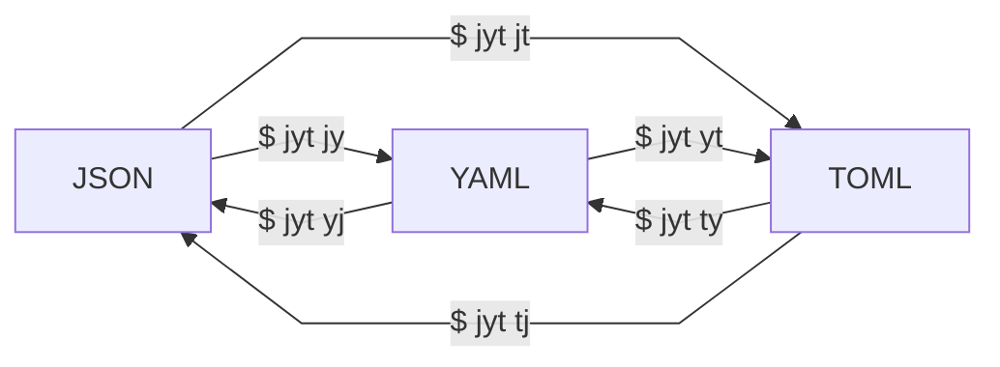

# jyt [](https://crates.io/crates/jyt)

A tridirectional converter between **J**son, **Y**aml, and **T**oml

## Usage



```bash
$ jyt
A tridirectional converter between Json, Yaml, and Toml

Usage: jyt <COMMAND>

Commands:
json-to-yaml  Convert Json to Yaml (also as json2yaml, j2y, jy)
json-to-toml  Convert Json to Toml (also as json2toml, j2t, jt)
yaml-to-json  Convert Yaml to Json (also as yaml2json, y2j, yj)
yaml-to-toml  Convert Yaml to Toml (also as yaml2toml, y2t, yt)
toml-to-json  Convert Toml to Json (also as toml2json, t2j, tj)
toml-to-yaml  Convert Toml to Yaml (also as toml2yaml, t2y, ty)
```

## Build

```bash
$ go build -trimpath -ldflags "-extldflags -static -w -s"
```
